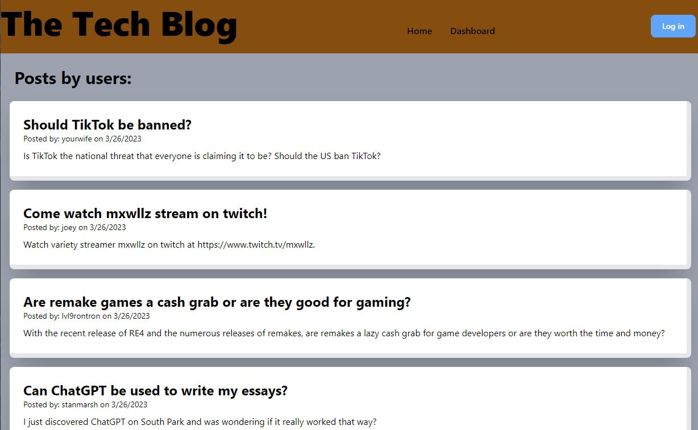
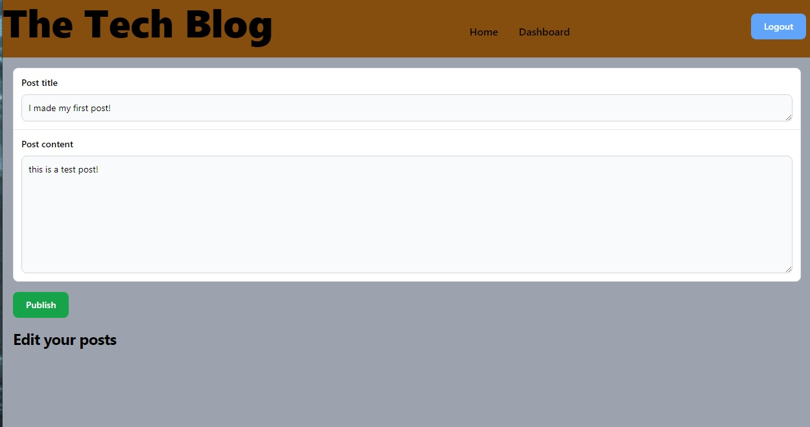
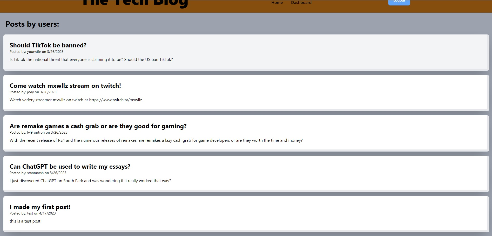

# Tech-Blog

  ## Description

  This application is a simple CMS-style blog where users can post blogs, view other users' blogs and write comments. This application focuses on using Node.js, Express, Sequelize, Handlebars, connect-session-sequelize to run the app. TailwindCSS was used for the styling.

  ## Table of Contents
  
  - [Installation](#installation)
  - [Credits](#credits)
  - [License](#license)
  - [Questions](#questions)

  ## Installation & Usage

  To use locally, follow these commands:
   
  Install node.js onto your computer.
  
  In the root folder of the app, run `npm i` to install the required packages.
  
  Run `npm run seed` to seed the data. Then run `npm run start` to start the application.
  
  ## Deployment
  
  Deployed Heroku application: https://dashboard.heroku.com/apps/vyang-tech-blog
  
  
  
  

  

  
  ## Credits

  StackOverflow

  ## License

  This application is not under any licenses.

  ## Questions

  For more information regarding this project, please send an email to vyang9887@gmail.com.

